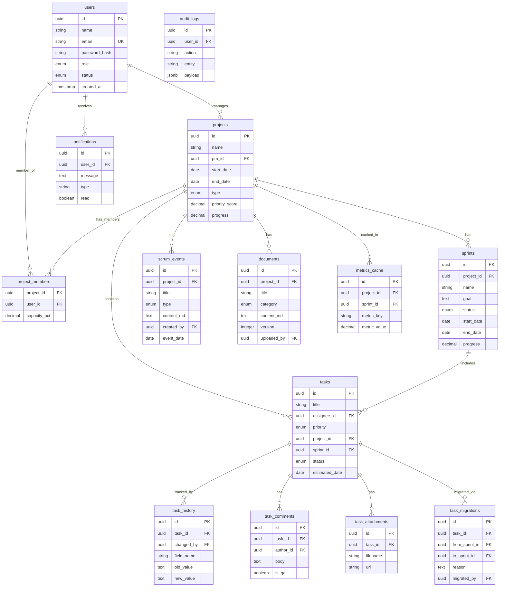

# Entity Relationship Diagram

```mermaid
erDiagram
    users {
        uuid id PK
        string name
        string email UK
        string password_hash
        enum role
        enum status
        timestamp created_at
    }
    projects {
        uuid id PK
        string name
        uuid pm_id FK
        date start_date
        date end_date
        enum type
        decimal priority_score
        decimal progress
    }
    project_members {
        uuid project_id FK
        uuid user_id FK
        decimal capacity_pct
    }
    sprints {
        uuid id PK
        uuid project_id FK
        string name
        text goal
        enum status
        date start_date
        date end_date
        decimal progress
    }
    tasks {
        uuid id PK
        string title
        uuid assignee_id FK
        enum priority
        uuid project_id FK
        uuid sprint_id FK
        enum status
        date estimated_date
    }
    task_history {
        uuid id PK
        uuid task_id FK
        uuid changed_by FK
        string field_name
        text old_value
        text new_value
    }
    task_comments {
        uuid id PK
        uuid task_id FK
        uuid author_id FK
        text body
        boolean is_qa
    }
    task_attachments {
        uuid id PK
        uuid task_id FK
        string filename
        string url
    }
    task_migrations {
        uuid id PK
        uuid task_id FK
        uuid from_sprint_id FK
        uuid to_sprint_id FK
        text reason
        uuid migrated_by FK
    }
    scrum_events {
        uuid id PK
        uuid project_id FK
        string title
        enum type
        text content_md
        uuid created_by FK
        date event_date
    }
    documents {
        uuid id PK
        uuid project_id FK
        string title
        enum category
        text content_md
        integer version
        uuid uploaded_by FK
    }
    audit_logs {
        uuid id PK
        uuid user_id FK
        string action
        string entity
        jsonb payload
    }
    notifications {
        uuid id PK
        uuid user_id FK
        text message
        string type
        boolean read
    }
    metrics_cache {
        uuid id PK
        uuid project_id FK
        uuid sprint_id FK
        string metric_key
        decimal metric_value
    }

    users ||--o{ projects : "manages"
    users ||--o{ project_members : "member_of"
    projects ||--o{ project_members : "has_members"
    projects ||--o{ sprints : "has"
    projects ||--o{ tasks : "contains"
    sprints ||--o{ tasks : "includes"
    tasks ||--o{ task_history : "tracked_by"
    tasks ||--o{ task_comments : "has"
    tasks ||--o{ task_attachments : "has"
    tasks ||--o{ task_migrations : "migrated_via"
    projects ||--o{ scrum_events : "has"
    projects ||--o{ documents : "has"
    users ||--o{ notifications : "receives"
    projects ||--o{ metrics_cache : "cached_in"
```
